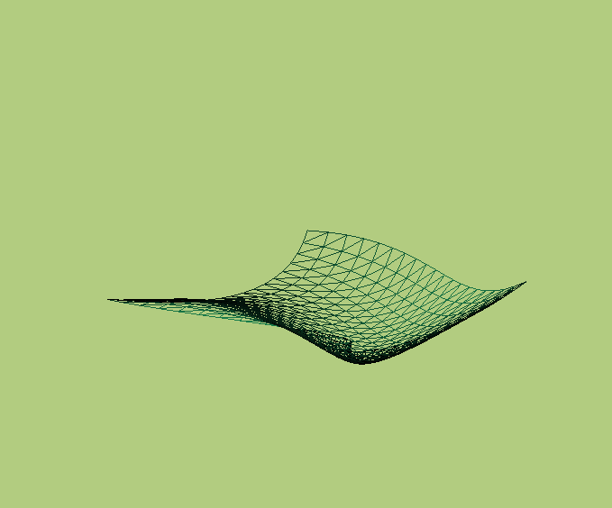

# Bezier surface #

Генерация и рендер поверхности Безье с диффузным и бликовым освещением. Реализован с помощью ```C++``` и ```OpenGL```, математика была сделана посредством библиотеки ```glm```.

### Уравнение поверхности Безье ###

[Поверхность Безье](https://ru.wikipedia.org/wiki/%D0%9F%D0%BE%D0%B2%D0%B5%D1%80%D1%85%D0%BD%D0%BE%D1%81%D1%82%D1%8C_%D0%91%D0%B5%D0%B7%D1%8C%D0%B5) порядка  задается  контрольными точками .

, где 

, а  - многочлен Бернштейна:


Генерация поверхности происходит на основе контрольных точек, указанных в figures/coords.txt.

## Аргументы при запуске ## 
```
./cw <flags>
```

## Флаги ##

+ ```-wframe``` - включение каркасной отрисовки;
+ ```-step n``` - установка значения отступа между точками поверхности  ;
+ ```-n n``` - установка порядка n поверхности Безье;
+ ```-m n``` - установка порядка m поверхности Безье.
'

## Пример ##
```
./cw  -step 0.05 -wframe
```




## Зависимости ##
Перед запуском программы необходимо установить библиотеки ```glfw-x11``` и ```glew```:

### Arch Linux ###

```
sudo pacman -S glfw-x11 glew
```

Также [скачать](https://glm.g-truc.net/0.9.9/index.html) ```glm```, после чего необходимо ее расположить в папку проекта.
