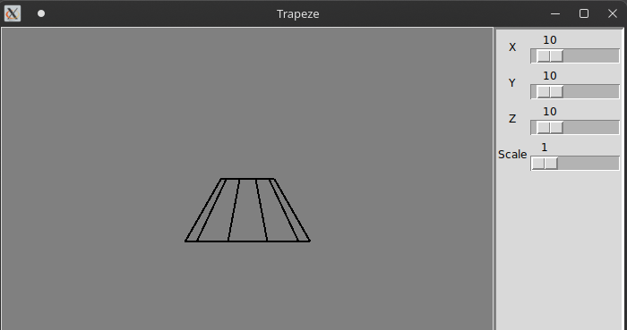

# Removing invisible lines #

Реализация алгоритма Роберста для удаления невидимых линий. Реализовано с помощью `python` и библиотек `tkinter` и `numpy`.

## Зависимости ##
Перед запуском программы необходимо установить библиотеки `tkinter` и `numpy`:

### Arch Linux ###

```
sudo pacman -S tk python-numpy
```

## Пример ##
```
python main.py
```


