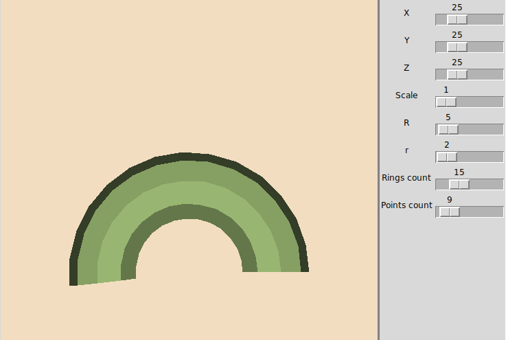
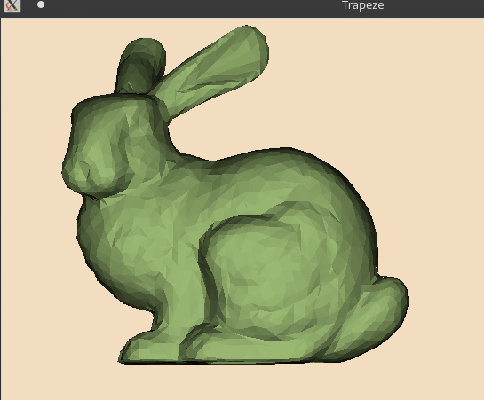

# Software rendering #

Реализация собственного рендера на `python` с помощью библиотек `tkinter` и `numpy`.
Вычисления нормалей происходит по левостороннему обходу полигонов. Для удаления невидимых линий используется Z-буферизация.

После изменения степени аппроксимации (`Rings count` и `Points count`)  рендер отрисовывает модель с обновленными полигонами. 

Также есть возможность отрисовки моделей из obj-файлов.
## Зависимости ##
Перед запуском программы необходимо установить библиотеки `tkinter` и `numpy`:

### Arch Linux ###

```
sudo pacman -S tk python-numpy
```

## Пример ##



