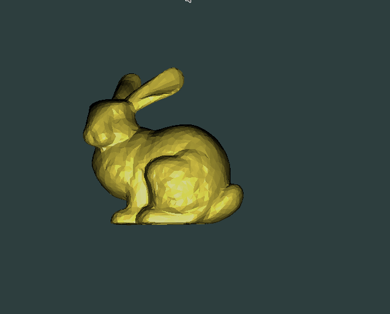
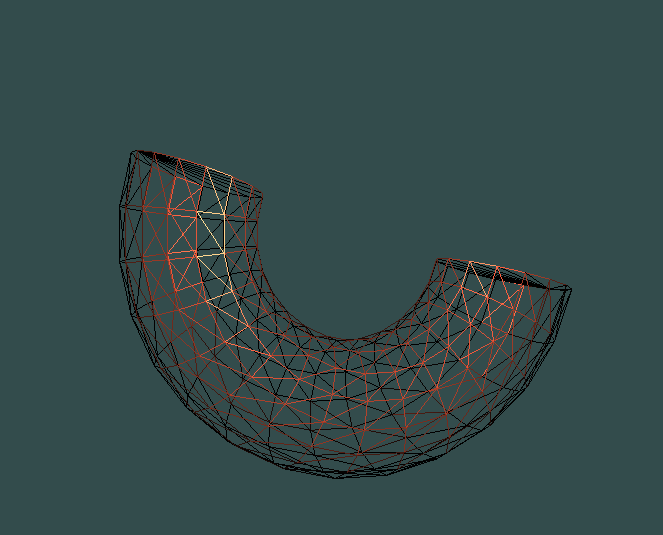

# 3D SHADER RENDERING #

Рендер с диффузным и бликовым освещением моделей. Реализован с помощью ```C++``` и ```OpenGL```, математика была сделана посредством библиотеки ```glm```.

Модели генерируются из obj-файлов, в которых должны содержаться данные о вершинах и полигонах.

Пользователь может выбрать материал, из которого будет "сделана" модель. Присутствует 3 материала: `gold`, `copper` и `plastic`.

Также присутствует внутренний генератор фигур. Присутствуют 2 фигуры: `hemisphere` и `horseshoe`.

## Аргументы при запуске ## 
```
./result <material> <modelName> <flags>
```

## Флаги ##

+ ```-wframe``` - включение каркасной отрисовки;
+ ```-generate figurename``` - генерация фигуры;
+ ```-scale n``` - масштабирование модели в n раз [n > 0];
+ ```-ystep n``` - задать отступ n по оси y (для генерации полусферы) [0 < n < 2];
+ ```-rcount n``` - задать количество колец (для генерации подковы) [n > 2];
+ ```-pcount n``` - задать количество боковых граней (для генерации фигур) [n > 2].

## Примеры ##
```
./result gold figures/bunny.obj -scale 50
```



```
./result copper -generate horseshoe -pcount 15 -wframe
```



## Зависимости ##
Перед запуском программы необходимо установить библиотеки ```glfw-x11``` и ```glew```:

### Arch Linux ###

```
sudo pacman -S glfw-x11 glew
```

Также [скачать](https://glm.g-truc.net/0.9.9/index.html) ```glm```, после чего необходимо ее расположить в папку проекта.