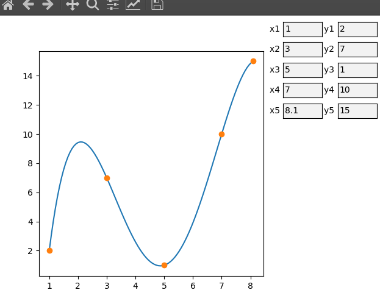

# The Lagrange interpolation polynomial #

Построение графика [интерполяционного многочлена Лагранжа](https://ru.wikipedia.org/wiki/%D0%98%D0%BD%D1%82%D0%B5%D1%80%D0%BF%D0%BE%D0%BB%D1%8F%D1%86%D0%B8%D0%BE%D0%BD%D0%BD%D1%8B%D0%B9_%D0%BC%D0%BD%D0%BE%D0%B3%D0%BE%D1%87%D0%BB%D0%B5%D0%BD_%D0%9B%D0%B0%D0%B3%D1%80%D0%B0%D0%BD%D0%B6%D0%B0) по 5 точкам реализовано с помощью `python` и библиотек `numpy` и `matplotlib`.

### Интерполяционный многочлен Лагранжа ###

Пусть задана  пара чисел , где все  различны.

, где

базисные полиномы  определяются по формуле:


## Зависимости ##
Необходимо поставить библиотеки `numpy` и `matplotlib`:
### Arch Linux ###
```
sudo pacman -S python-numpy python-matplotlib
```
## Пример ##
```
python main.py
```

